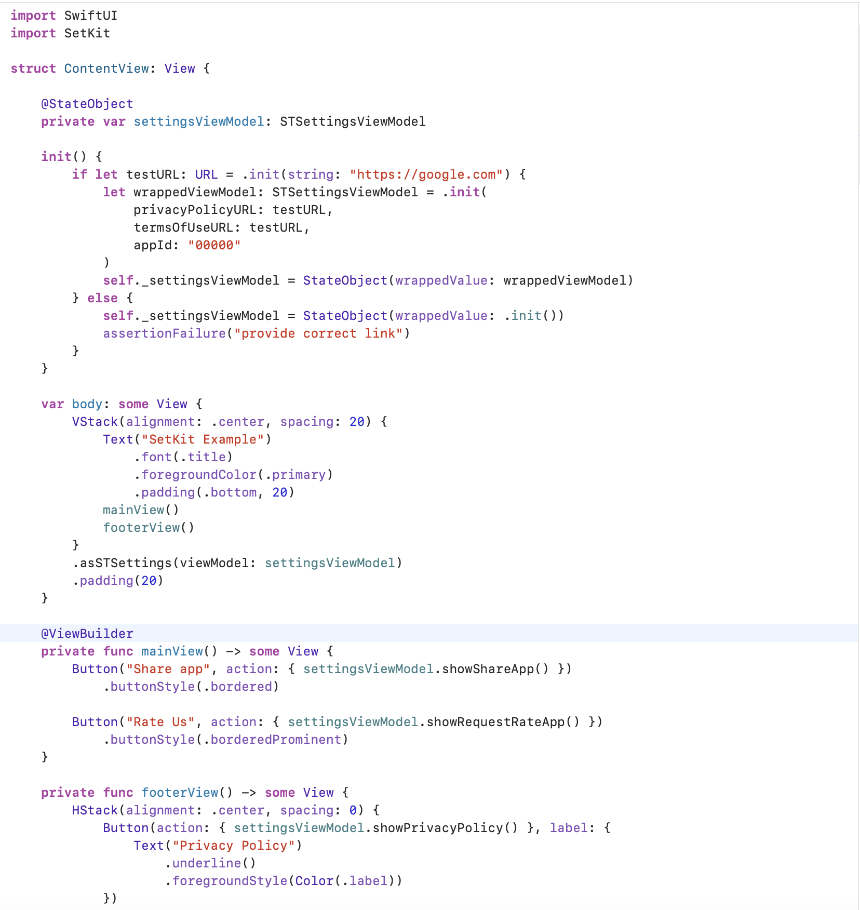

# SetKit

SetKit is a simple tool for implement basic settings for any iOS app.
In version 1.0.0 it contains showing your 
    - privacy policy
    - contact us
    - terms of usage
    
Also it contains asking feedback and sharing your app functionality 

# Getting Started

## How to use

    - Import SetKit

    To make your view settingsView just use modifier
        .asSTSettings(viewModel: settingsViewModel)
    
    Here is the sample example how to use it

## How it works

    Here is the example how you can use it

